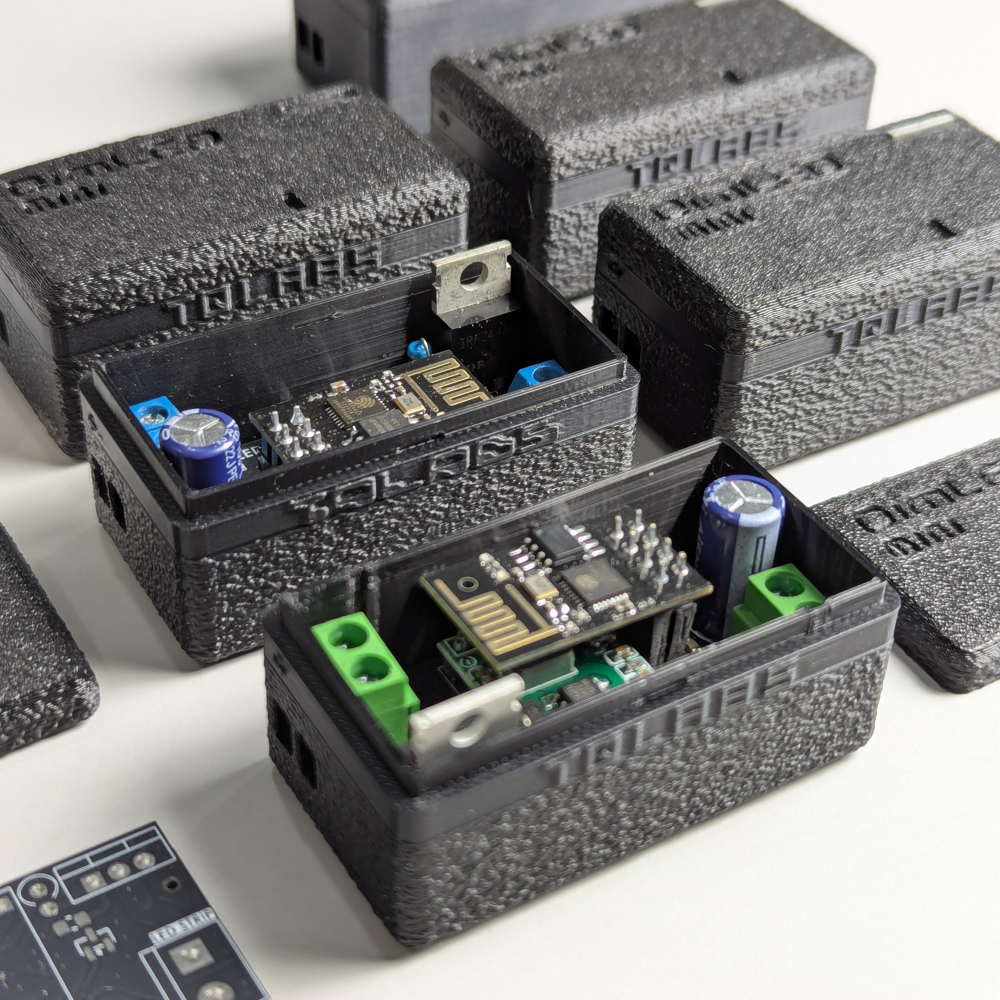
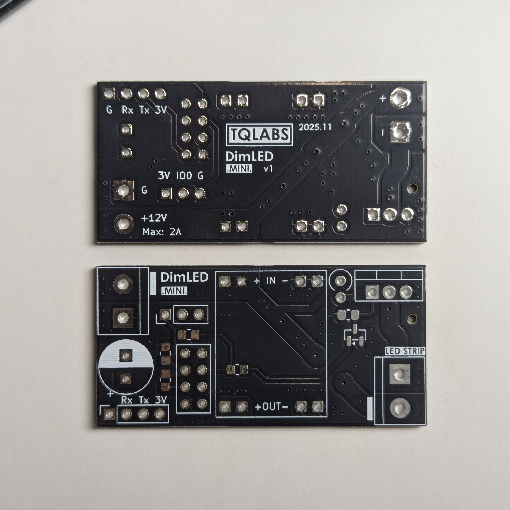
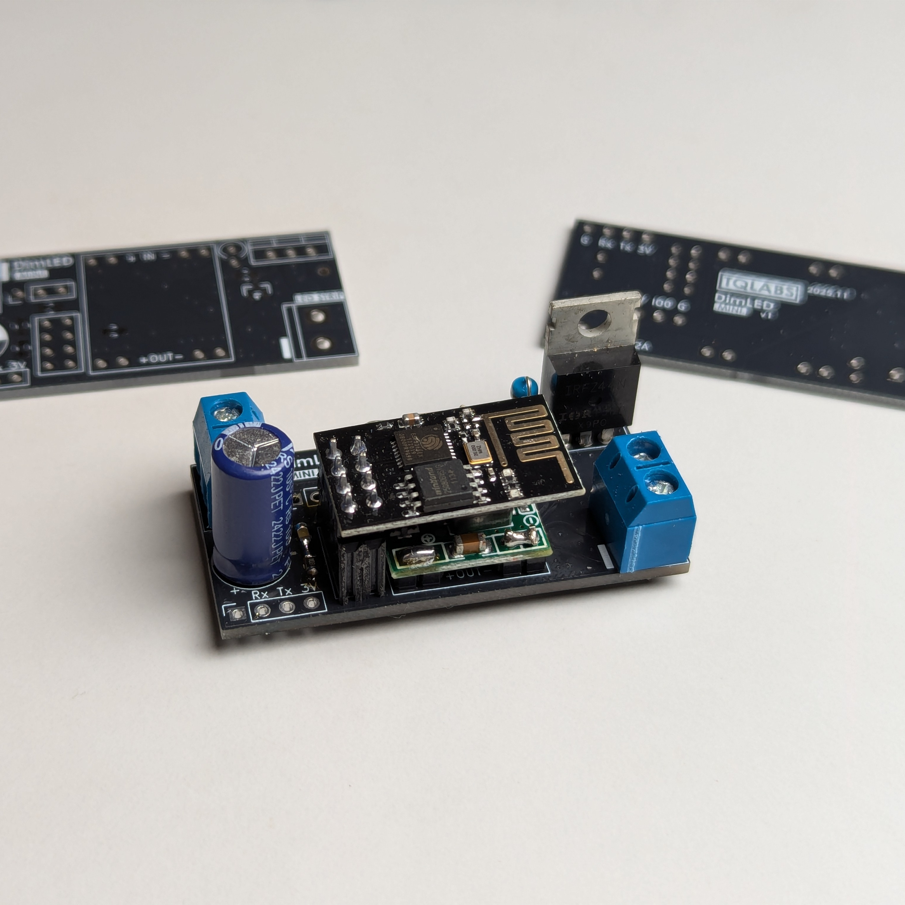
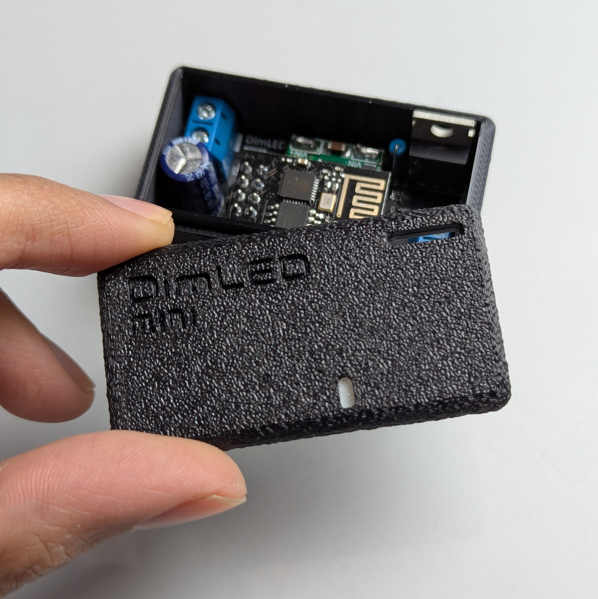
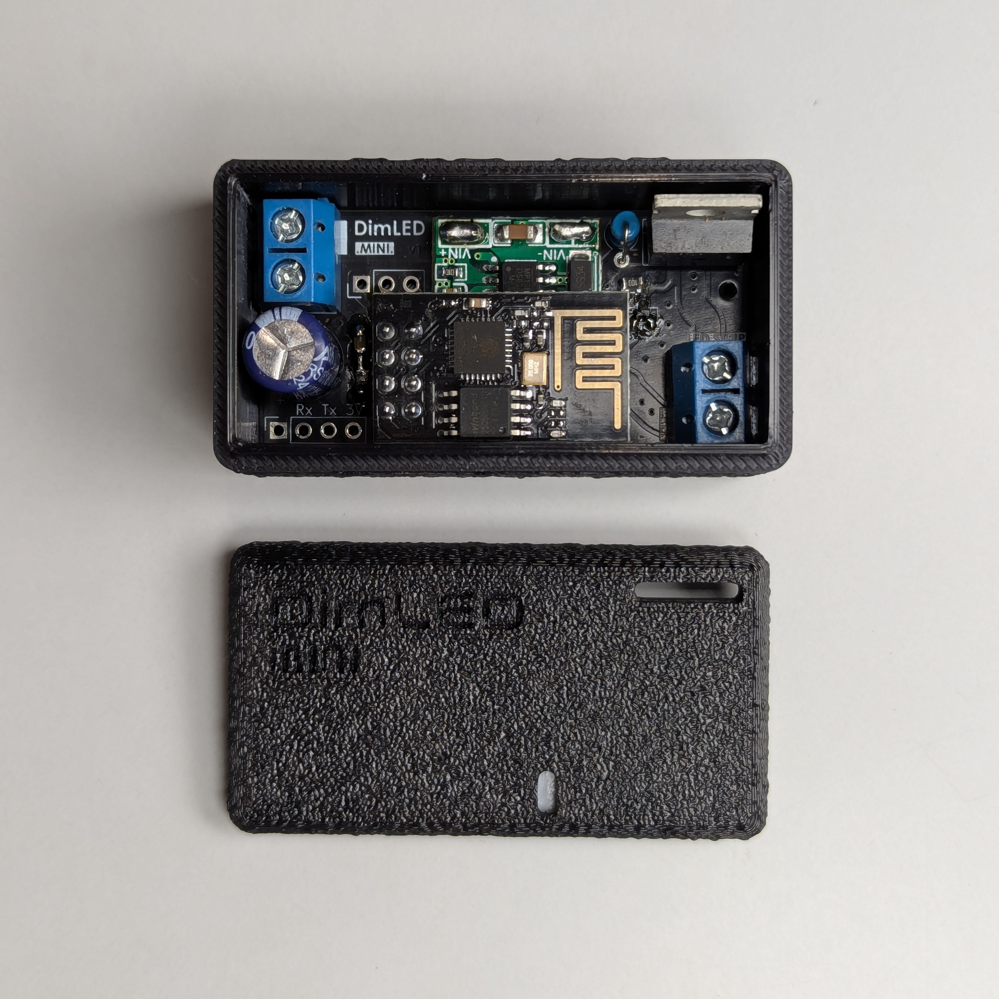
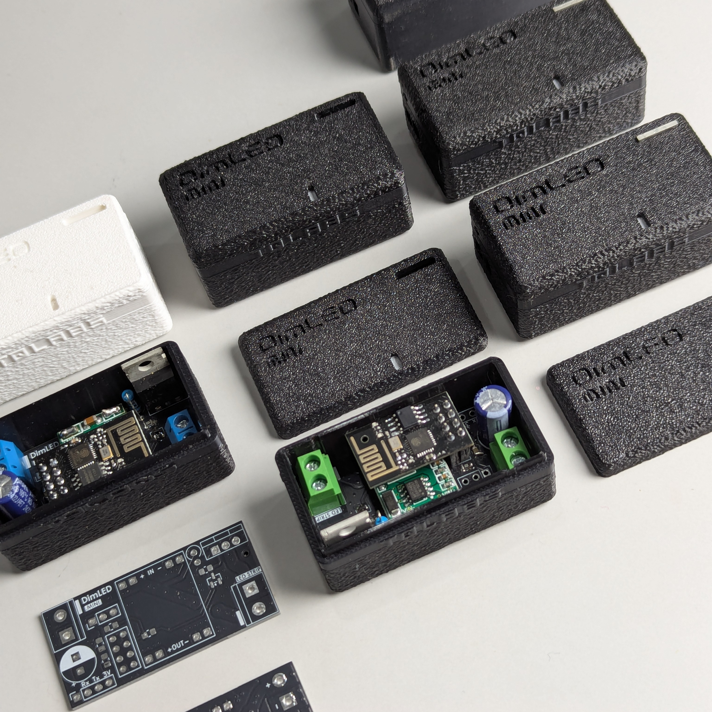
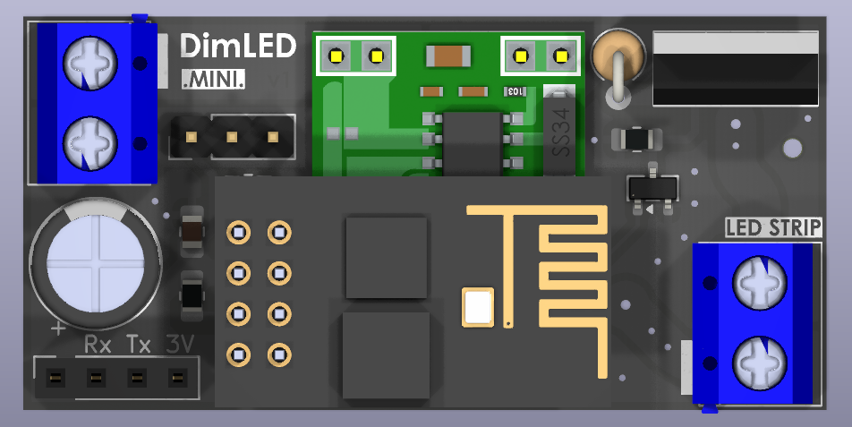
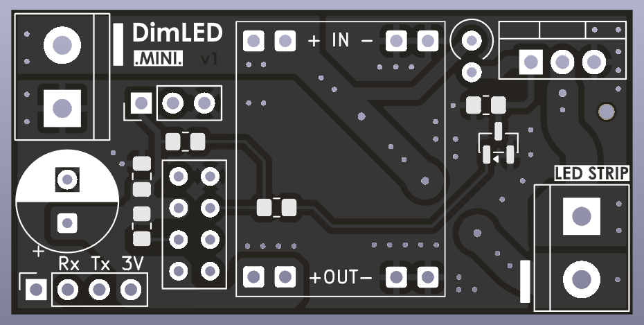
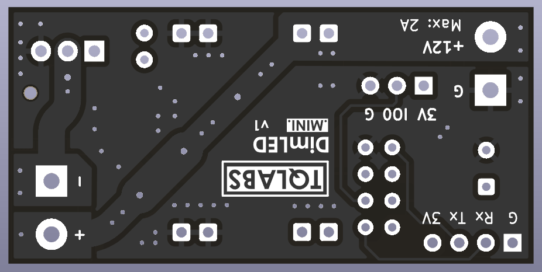

  <a href="https://github.com/tqlabs-in/dimled-mini">
    <picture>
      <source srcset="assets/logo-dimled-mini-dark.svg" media="(prefers-color-scheme: dark)">
      <source srcset="assets/logo-dimled-mini-light.svg" media="(prefers-color-scheme: light)">
      
    </picture>
  </a>

<q style="font-style: italic; font-weight: bold;"> Open Source PWM LED Dimmer powered by ESPHome </q>

  <a href=""></img></a>
  

## 😎 Product Photography

  
  
  
  
  
  

## 🎰 PCB Renders

  
  
  

## 🧲 Useful Links

- [Web Flasher](https://tqlabs-in.github.io/dimled-mini/)
- [BOM](https://htmlpreview.github.io/?https://raw.githubusercontent.com/tqlabs-in/dimled-mini/main/pcb/bom/ibom.html)

## 🍀 Show your Support

Give a ⭐️ if this project helped you or you find it interesting!
